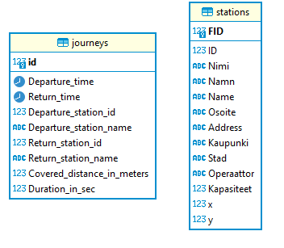

# Helsinki city bike app (Dev Academy pre-assignment)

This is the pre-assignment for the Solita Dev Academy Finland 2023.

## Getting started

<h3>1. Create a database</h3>

In the backend folder, you will find the DBScript.sql file.   

Open it and copy all of its content. 

Open your SQL database in the terminal and paste the content of the file. 

When it is done, you will have a database.

<h3>2. Configure .env file</h3>

In the root of the frontend and backend folders, you will find .env files
Open them and change the values if needed:

| Field name            | Description                                                                                                             |
|-----------------------|-------------------------------------------------------------------------------------------------------------------------|
| DATABASE_DIALECT      | mariadb                                                                                                                 |
| DATABASE_NAME         | name of your database, helsinki_city_bike is default                                                                    |
| DATABASE_USER         | username of your SQL database                                                                                           |
| DATABASE_PASSWORD     | password for the username                                                                                               |
| SERVER_HOST           | hostname, localhost is default                                                                                          |
| SERVER_PORT           | port number, where you wish to run API , 8080 is default                                                                |
| CORS_ORIGIN           | base URL of your application = where your application (UI) is running, http://localhost:3000 is default                 |
| REACT_APP_SERVER_HOST | hostname should be the same as SERVER_HOST, localhost is default                                                        |
| REACT_APP_SERVER_PORT | port number should be the same as SERVER_PORT                                                                           |
| REACT_APP_SERVER_PORT | http://localhost:8080   isdefault                                                                                       |

<h3>3. Install npm packages</h3>

Go into the frontend and backend folders one by one and write the following command in the console:

<code>npm i</code>

<h3>4.  Data</h3> 
   <h4>There are two variants(4.1 or 4.2):</h4>
   <h4>4.1.1 Add data to the data folders:</h4> 

 Download the following files:
  
  https://dev.hsl.fi/citybikes/od-trips-2021/2021-05.csv  
  https://dev.hsl.fi/citybikes/od-trips-2021/2021-06.csv  
  https://dev.hsl.fi/citybikes/od-trips-2021/2021-07.csv  
  
  Put them in the following location:
  
  backend/data/csv/journeys
  
  **Important!** Delete addDatahere file.
  
  **Note:** backend/data/csv/bicycle-stations-dataset has already file inside, and it accepts another files with same format if it is desired 
  (source: https://opendata.arcgis.com/datasets/726277c507ef4914b0aec3cbcfcbfafc_0.csv)
  
  <h4>4.1.2 Activate the converter:</h4> 
  
  <ul>
   <li>Go to -> backend/server.js file and uncomment the 32nd row </li>
   <li>Write the following command in the console:<code> npm run start</code></li>  //todo make another separeted logic for converter
   <li>Wait about 3 hours for the results to be converted. On success, comment back the 32nd line and reload the application.</li>
  </ul>
  
  <h4>4.2 Import dumped database from the resource : https://drive.google.com/file/d/1-1cURsNInHa1pqPPQryHpmYQvUVE6Iy7/view?usp=share_link</h4> 
 
  
<h3>5. Backend usage</h3> 
<b>To run backend</b> go the backend folder and write command: <code> npm run start</code>

By default it will be run  on the http://localhost:8080/

Then , in your usage will be different paths, that are described in the swagger http://localhost:8080/api-docs/

And here are er diagrams , for better understanding with which format the api works 

  
<h3>6. Frontend usage</h3>
<b>To run it</b>To run the frontend, go to the frontend folder and write the following command in the console: <code> npm run start</code>

By default it will be run  on the http://localhost:3000/ port You can change it in the .env file.

  
